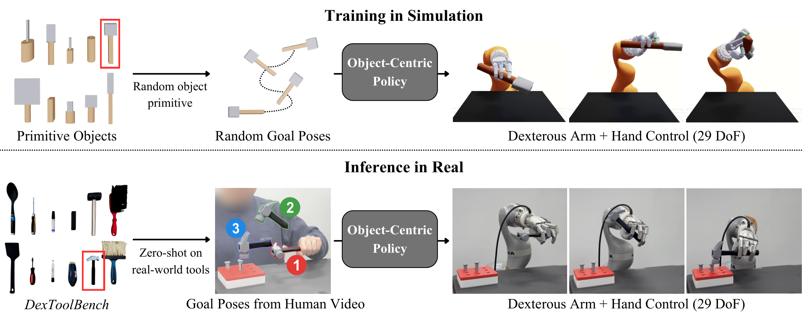
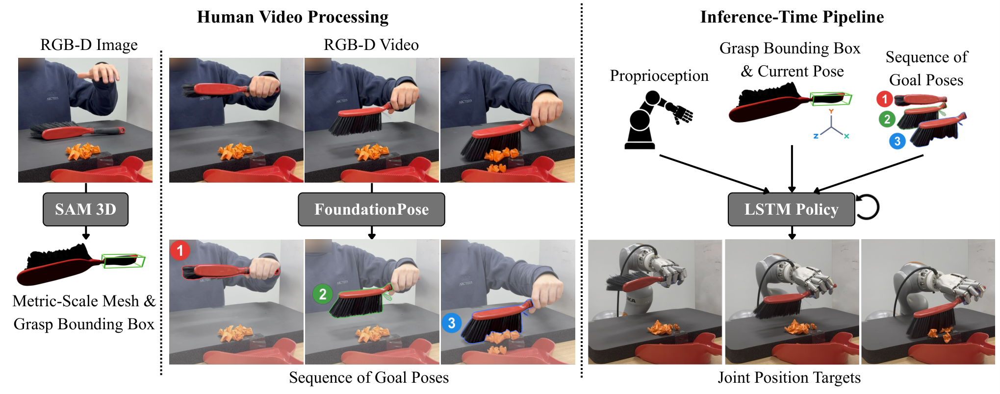
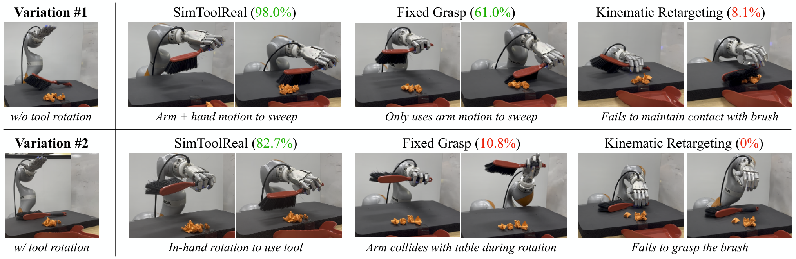
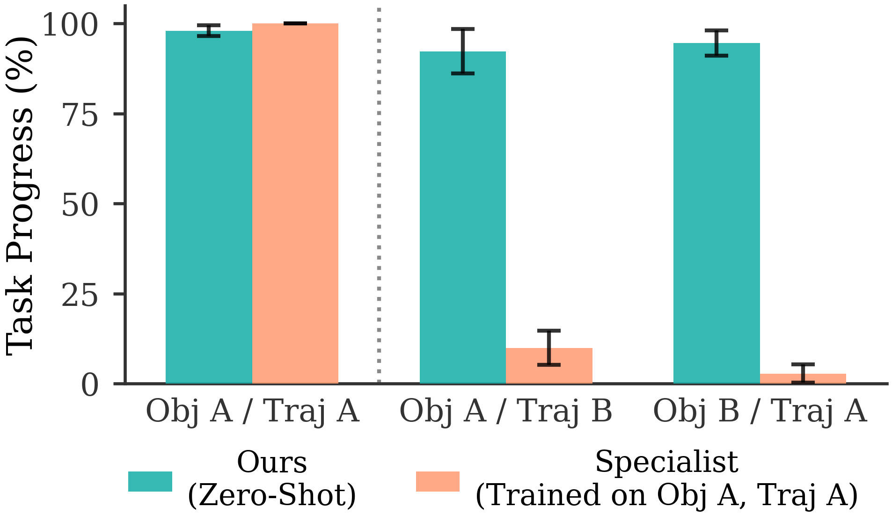
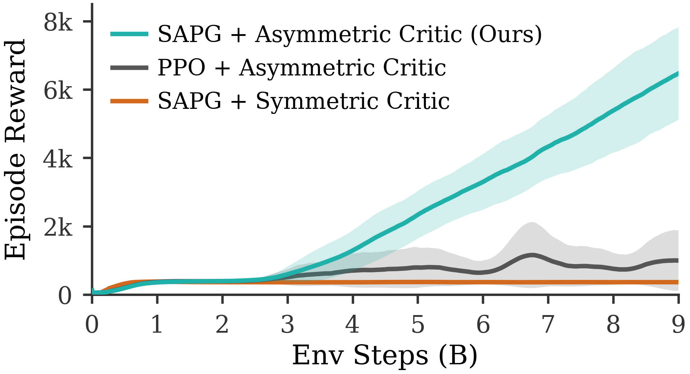

# SimToolReal：论文解读与汇报叙事核对

## 1. 基本信息与结论

- **论文**：SimToolReal: An Object-Centric Policy for Zero-Shot Dexterous Tool Manipulation
- **作者**：Kushal Kedia、Tyler Ga Wei Lum、Jeannette Bohg、C. Karen Liu。
- **单位**：Cornell University、Stanford University。
- **版本**：arXiv:2602.16863v2，2026-02-24。本解读以用户提供论文的 v2 正文及附录为依据。
- **发表状态**：RSS 2026 官方 proceedings 收录，DOI 10.15607/RSS.2026.XXII.151。
- **类型**：Empirical，兼有系统与 benchmark 贡献。
- **一句话**：在程序化生成的工具几何和随机目标位姿上训练一个 object-centric RL policy，再用人类 RGB-D 视频提取的工具轨迹指导真实机器人，无需针对目标工具或目标轨迹重新训练策略。

来源：[论文](https://arxiv.org/abs/2602.16863v2)、[RSS proceedings](https://www.roboticsproceedings.org/rss22/p151.html)、[项目](https://simtoolreal.github.io/)。

**总体判断：你的汇报主线成立，而且抓住了论文最有价值的接口设计。但应把“in-the-wild 学习”“推广到其他交互”“VLM 替换感知”明确写成研究假设，不能作为本文已经证明的结论。**

## 2. 对原始陈述逐项核对

| 原始想法 | 判断 | 建议采用的准确表述 |
|---|---|---|
| 从机器人使用工具的场景开始 | 很合适 | 用刷子或锤子的 grasp–reorient–interact 展示问题，先让听众看到技能组合的困难。 |
| 问机器人学会工具使用有几种技术路线 | 很合适 | 对比 robot demonstrations/IL、human video/retargeting、planning/fixed grasp、task-specific sim-to-real RL。强调这些路线可组合。 |
| 列出模仿学习、diffusion、大模型等路线 | 需要分类 | IL 是训练范式，diffusion 是动作建模方式，VLA 是模型与输入输出架构；它们不是互斥的同一级类别。 |
| 把工具使用简化成追踪一系列 6D poses | 基本准确 | 这是任务描述与控制接口的简化，而非“物理任务成功完全由 pose 决定”。 |
| 使用 RL 学习通用操作策略 | 需要限定通用范围 | 一个针对所用 arm–hand embodiment 的、跨工具实例与目标轨迹可复用的 goal-reaching policy，不是任意机器人/任意任务的通用策略。 |
| 检测工具共同点之后就能使用工具 | 需要改写 | 共同结构由 handle–head prior、tool pose 与 coarse grasp box 人为定义。感知模块恢复该接口，并非自动学出所有工具的功能语义。 |
| 无需采集示范数据 | 不准确 | 策略训练不用目标任务示范或机器人动作示范；部署仍需要 RGB-D 人类视频来提供目标轨迹。 |
| 不需要物体建模 | 需要区分用途 | 不需要为新工具建立仿真资产并训练策略；部署仍重建 metric-scale mesh，供感知与跟踪使用。 |
| 自动完整 pipeline | 需要限定 | 执行是闭环的，但前处理为 semi-automated，需要物体及 handle/head 点选等人工输入。 |
| 实验成功率很高 | 指标不能混用 | 主指标为 Task Progress，即达到的目标位姿比例。它不等价于 functional task success rate。 |

正文依据：§I–IV；人工步骤依据：Human Video Processing appendix 与 Fig. 12；限制依据：§V。[完整论文](https://arxiv.org/html/2602.16863v2)

## 3. 建议的详细逻辑链条

### 第一步：工具使用为什么是合适的切入点？

工具扩展机器人对环境的作用方式，但抓住物体只是开端。以刷子为例，机器人需要从桌面拿起薄柄、在手内旋转到可用姿态，并在接触桌面时保持控制。这把 grasp acquisition、in-hand reorientation 与 environment interaction 连在同一个任务里。

开场先向听众提问“假如要让机器人学会使用工具，你会怎么做？”，再逐步揭示数据模仿、human retargeting 和 simulation learning 等路线。不急于讲网络，也不把问题限定为“该用什么模型”。

### 第二步：现有路线把困难放在什么地方？

1. **Robot demonstrations / IL**：从机器人动作监督中学策略。挑战是高质量灵巧操作数据的获取，而不是 IL 在原理上不能处理工具。
2. **Human video / retargeting**：人演示很自然，但人和机器人手不同；匹配运动学轨迹不保证接触力与稳定抓握。
3. **Planning with a fixed grasp**：可以规划手臂运动，但工具与手之间保持刚性关系会限制可行姿态；手内旋转有时不可替代。
4. **Task-specific sim-to-real RL**：通过物理交互学接触策略，但新物体/任务常要求重新构建环境、调整 reward、训练 specialist。

本文没有与完整的 diffusion policy 或 VLA 强基线做直接实验证明。因此开场比较属于方法定位，不应变成“本文证明大模型/IL 不行”。

### 第三步：问题能否换一个可复用的描述接口？

不把任务直接写成人类手指轨迹，也不为每一种任务设计一个独立技能输出。改为指定：**希望工具依次到达什么位置与朝向？**

人提供 object motion intent，RL 负责该机器人如何通过自己的手臂和手指实现这个 motion。工具的轨迹比人类手部动作更容易跨 embodiment 传递，但执行仍必须解决接触动力学。

### 第四步：把复杂任务拆成两层

- **高层目标**：工具的目标位姿序列 \(\{g^k\}_{k=1}^K\)，其中 \(g^k\in SE(3)\)。
- **低层控制**：\(a_t=\pi_\theta(s_t,o_t,\phi,g^k)\)。\(s_t\) 是 proprioception，\(o_t\) 是当前工具位姿，\(\phi\) 是 coarse grasp-region descriptor。紧凑公式省略了 LSTM 的历史状态。

当前目标达到后才切换到下一个目标。这里跟踪的是 spatial waypoints，而非严格复现人的时间曲线。示范轨迹采样到 3 Hz，不意味着机器人每 1/3 秒切换目标。

### 第五步：如何在没有具体工具任务示范的情况下训练？

生成大量简单的 handle–head 工具，随机化尺寸、形状和密度。在物理仿真中随机采样目标位姿。初始目标覆盖较大的可达空间，随后目标相对前一目标扰动，使动作呈现连续轨迹的特点。

机器人先得把物体从桌面抓起来，之后才能不断获得 goal-reaching reward。因此 grasping 和 in-hand reorientation 成为实现统一目标所需的手段。

### 第六步：“工具共同点”到底是什么？

这是一种**设计出来的结构先验**，不是一个自动工具语义归纳算法：

- 仿真对象由 head 与 handle 组合，使用简单 cuboid / capsule 等几何。
- 改变几何与各部分密度，以覆盖抓握和惯性差异。
- 策略只接收可在真实系统中可靠恢复的工具位姿与粗抓取区域。
- 不直接输入精确质量、惯量、完整视觉或详细 mesh；LSTM 利用交互历史处理部分不可观测性。

这个取舍减少 actor 需要跨越的视觉 sim-to-real gap，但把状态估计精度变成系统前提。

### 第七步：真实部署如何恢复统一接口？

先完整解释仿真训练和 LSTM，展示仿真 reaching 视频后，再用观测来源的变化过渡：仿真器能提供 ground truth，但真实机器人必须估计状态。需要强调，训练 actor 接收的是加入噪声/延迟的观测，不能把它误讲成直接依赖无误差真值的策略。

1. 从初始 RGB-D 图像分割物体。附录使用 SAM 2 和用户点选，优先选择交互前、遮挡较少的帧。
2. SAM 3D 重建物体 mesh，使用实际 depth 保证 metric scale。
3. 多视角渲染 mesh，再通过 SAM 2 与用户点选分离 handle/head。
4. 根据 handle 形成抓取区域 bounding box，并建立与训练一致的 canonical frame。
5. FoundationPose 从 RGB-D 人类视频提取工具位姿序列，下采样并截去静止的 pre-grasp 片段。
6. 执行时 FoundationPose 持续跟踪当前工具位姿，策略结合 robot state 与目标位姿输出 joint targets。

**三个频率**：示范目标轨迹下采样 3 Hz；在线位姿跟踪 30 Hz；控制 60 Hz。目标切换取决于误差阈值。

### 第八步：实验到底验证了什么？

组会正文先看六类工具的实机视频，再保留一页数字概览。Task Progress 是目标序列中已经到达的位姿比例，评价阈值为四个 keypoints 中最大距离小于 2 cm。这个距离同时受到 translation 和 rotation 影响。

实机跨工具迁移作为正文重点；与动作执行方式的对比、仿真 specialist 与消融放在备份。视频是作者挑选的定性示例，不能代替随机试验统计。最后以 recovery 和作者限制连接到讨论。

## 4. 技术贡献与关键实现

### 4.1 统一的训练目标

\[
r=r_{\mathrm{smooth}}+r_{\mathrm{grasp}}+\mathbb I_{\mathrm{grasped}}r_{\mathrm{goal}}
\]

\[
r_{\mathrm{goal}}=\max(d^*-d(o_t,g),0)+B_{\mathrm{succ}}\mathbb I[d(o_t,g)<\epsilon]
\]

\(d^*\) 记录当前目标已取得的最小距离，新的目标到来时重置。因此 dense reward 鼓励进步，不能靠一直停在目标附近反复获得收益。奖励仍包含工程设计的 approach、lift 与 smoothness terms，不能说“完全没有 reward engineering”。

### 4.2 物理多样性与观测抽象

几何多样性让策略经历不同的抓取和旋转条件；handle/head 密度差异覆盖重心与惯性变化。粗几何描述比完整视觉输入更容易跨 sim-real 对齐。代价是控制器不直接看完整环境，且必须信任外部跟踪。

### 4.3 RL 与 transfer 的实现

- IsaacGym，24,576 parallel environments。
- 7-DoF KUKA iiwa 14 与 22-DoF Sharpa 左手，共 29 DoF。
- Actor：LSTM[1024] + MLP[1024,1024,512,512]。
- Critic：MLP[1024,1024,512,512]，使用额外 privileged simulator state。
- SAPG：通过多策略探索与经验聚合改善本文设置下的探索瓶颈。
- Domain randomization：pose noise、感知/动作延迟、grasp box 扰动、外力与力矩等。
- 仿真/控制为 120/60 Hz；训练 pose tolerance 1 cm，实验评价 2 cm。

避免把它描述成一个“极轻量 MLP”或“低计算成本”系统。Fig. 7 的训练横轴到 120 billion environment steps；论文相关图并不直接提供可由此推得的 wall-clock 成本。

### 4.4 LSTM policy：观测、记忆与动作处理

依据 Appendix C.2–C.3 和 Table I，策略输入包括：

- Robot proprioception：29 个关节位置、29 个关节速度、上一时刻 joint targets、掌心位姿，以及 5 个指尖相对掌心的位置。
- Tool / goal：工具朝向、4 个相对掌心的工具 keypoints、4 个 object-to-goal keypoint errors，以及 grasp region 的尺寸。
- Observation keypoints 随工具实例的 grasp box 尺寸变化。Reward keypoints 使用固定尺度，二者不要混淆。

以标准 LSTM 记号作解释，可写为 `(h_t, c_t) = LSTM(x_t, h_{t-1}, c_{t-1})`，MLP head 再将 recurrent features 映射为 29 维动作。论文报告 1024-unit LSTM 与 `[1024, 1024, 512, 512]` MLP。历史信息帮助处理未直接观测的物理与几何差异；论文没有证明某个 hidden unit 显式估计质量，也没有提出新的 LSTM gate。

[作者公开配置](https://github.com/tylerlum/simtoolreal/blob/313d5aea1f507c6cfe097b672b62945d7b0bbff5/isaacgymenvs/cfg/train/SimToolRealLSTMAsymmetricPPO.yaml) 进一步确认 `layers: 1`、`before_mlp: True`、`layer_norm: True`，MLP activation 为 ELU。这里把配置核对作为架构细节的补充来源，不将其解读为新的论文实验结论。

动作裁剪到 `[-1, 1]` 后分两路处理：7-DoF arm 使用相对上一 joint target 的增量，比例为 0.025；22-DoF hand 将输出映射到关节限制范围中的绝对位置。两路使用 EMA smoothing，α 为 0.1，并有 joint-limit clipping。最终以 60 Hz 发送 joint-position targets。部署时 hidden/cell state 会更新，policy weights 保持不变；不能把 recurrent state 更新讲成在线微调。

## 5. 实验事实

### 5.1 真实机器人迁移

DexToolBench 覆盖 6 类工具、12 个实例、24 个 object–task variations，各 5 次试验，共 120 real-world rollouts。所有目标工具和目标轨迹在训练时未使用。

根据 Table II 发布的逐次 rollout 数值重新计算：

| 工具类别 | 平均 Task Progress |
|---|---:|
| Hammer | 89.360% |
| Marker | 78.605% |
| Eraser | 100.00% |
| Brush | 73.810% |
| Spatula | 76.025% |
| Screwdriver | 57.745% |
| 全部 120 rollouts | 79.26% |

以上是**汇报者从发表数据的再聚合**，不是论文摘要中的额外指标，也不是二值任务成功率。原始输入见 [real_world_results.csv](real_world_results.csv)。由于论文逐次值经过四舍五入，重新平均可能与作者单行 Avg 在末位有差异。

Eraser 的动作主要是平移。Screwdriver 包括 functional reorientation 与 continuous spinning，是最困难类别之一。注意 screwdriver 演示为 free-space spin，不能把它讲成完成拧紧螺丝。

### 5.2 与 kinematic retargeting、fixed grasp 的真实对比

| Red-brush sweep 变体 | SimToolReal | Fixed Grasp | Kinematic Retargeting |
|---|---:|---:|---:|
| 不需要初始工具旋转 | 98.0% | 61.0% | 8.1% |
| 需要 90° 工具旋转 | 82.7% | 10.8% | 0.0% |

单位均为 Task Progress，各变体 5 次试验。第一行与 fixed grasp 的差是 **37 percentage points**。不要把摘要中的“37%”讲成全部任务上统一的相对成功率提升。

Fixed Grasp 先用 SimToolReal 完成初始抓握，之后固定手部目标并规划 arm trajectory。比较针对两种 brush 初始状态，不是六类工具的全面 baseline 对比。

### 5.3 Specialist 对比属于仿真实验

每类训练一个 specialist，共六个；使用同样的策略架构和主要训练设置，但限制在一个物体实例与一条轨迹。改变轨迹或物体时 specialist 的表现明显下降，通用策略维持较高进度。每种条件每类 10 次 rollout。

这是支持泛化能力的重要证据，但不能说“真实机器人上全面击败 specialist”。Slides 直接保留原图，不从柱高猜测未经公布的精确数值。

### 5.4 Training proxy 与消融

Fig. 7 中，primitive random-goal training reward 与 unseen-tool trajectory progress 大体同步增长，支持该 proxy objective 的实用性，但不能把相关性讲成任意工具泛化的数学保证。

Fig. 8 的 5-seed 消融显示，在本文设置中移除 asymmetric critic 或用 PPO 替换 SAPG 都显著降低训练 reward。它不是 real-world success 消融，也没有完整隔离 LSTM、每个 randomization term、几何多样性及视觉前端的所有贡献。

### 5.5 失败原因

- Pose tracking loss：43.7%。
- Object drops：34.5%。
- 未能完成手内旋转并达到目标：18.2%。
- Grasp failure：3.6%。

分母是**发生的失败**，不是全部 120 rollouts。遮挡、旋转对称、低对比度是跟踪失效的重要条件。附录还提到给长 screwdriver 添加彩色胶带以减轻旋转对称歧义。这些细节很适合用来限制“完全开放世界”的表述。

## 6. 三个引申是否成立？

### 引申一：大模型之外，另一条通往 in-the-wild 技能的路径

**作为方向成立；作为本文完成的结果不成立。**

最准确的表述是：

> Structured sim-to-real RL may provide reusable motor skills that complement end-to-end action models on the path toward in-the-wild deployment.

理由是这篇工作确实降低了对目标工具/目标任务策略训练的依赖。不过它是仿真预训练后迁移执行，不是在野外自动发现和学习新技能。任务意图、目标轨迹、metric geometry、相机标定等仍由结构化流程提供；系统本身也使用 vision foundation models。

所以更值得讨论的是“哪些能力应该靠结构化 motor policy 获得，哪些交给高层模型”，而不是“RL 与所有大模型二选一”。

### 引申二：其他与环境交互也可能被简化

**合理，并且与本文的核心方法论一致；但不能扩大成全部交互都可用 pose-only。**

可研究的是 task-sufficient representation：

- 刚性物体搬运、重定位：object pose 可能足够作为主要目标，但仍需 obstacle/contact constraints。
- 门、抽屉：需要 articulation state、约束运动及 contact mode。
- 插入、打磨、强力接触：通常还需力、顺应性或接触状态目标。
- 柔性物体：需要形状或 task-relevant keypoints，单个 rigid pose 不足。

这些都是本文之外的候选方向。重要研究问题不是“还能删掉多少输入”，而是“删除后是否仍保留决定任务成败的状态”。

### 引申三：用 lightweight VLM 改进或替换感知

**改进语义接口是合理假设；直接替换整套高频 6D tracking 没有本文证据。**

应拆分两个子问题：

1. **语义与初始化**：选择工具、定位可抓取区域、识别 handle/head、解释任务、生成/修正 subgoals。VLM 可能减少人工点选并增强跨类别能力。
2. **度量状态估计与闭环**：厘米级 metric pose、遮挡下持续跟踪、低延迟输出、可靠性与置信度。语义理解能力不会自动保证这些性质。

更稳健的初始方案是：

> Lightweight VLM for semantic grounding and subgoal selection + geometry-grounded state estimation + goal-conditioned RL control.

这不排除训练专门的 VLM-based pose estimator，但必须测 pose error、latency、tracking-loss、intervention 与 functional success，不能仅凭语言泛化能力推断整体系统更通用。

## 7. 批判性评价与可复现性

### 作者明确承认的边界

- 轨迹跟踪不保证功能任务完成，尤其是高力接触。
- Policy 对完整环境状态不敏感，clutter 中可能碰撞。
- 假设工具为 rigid；例如 scissors 需要额外内部状态。
- 高层目标序列固定，不动态重规划。

### 本汇报补充的审慎观察

- Baseline 覆盖不均衡：真实实验的固定抓取/retargeting 比较限于 brush；specialist 比较在仿真。
- 没有现代 IL/VLA 的同预算比较，不能推出这些路线较差。
- 训练期不需要真实示范，不代表整个系统没有 foundation-model 数据或计算依赖。
- 人工点选、标定和部分对象的可跟踪性处理，都是走向 in-the-wild 时需要进一步降低的 setup burden。
- 一种 arm–hand embodiment 的展示不能直接支持跨机器人泛化。

### 与近邻工作的差别

- **Chen et al., Object-Centric Dexterous Manipulation from Human Motion Data (CoRL 2024)**：同样强调对象运动与 functional retargeting。SimToolReal 的差别是先学可复用的 random-goal controller，部署新示范不再逐任务训练。
- **Lum et al., Crossing the Human-Robot Embodiment Gap with Sim-to-Real RL Using One Human Demonstration (2025)**：从人类示范到物理可执行策略，是本文直接对照的前驱思路。本文把目标工具与示范轨迹移出策略训练过程。
- **DexPBT (2023)**：为 dexterous arm–hand RL 提供训练环境与相关 reward 基础。本文扩展到 procedural tool geometry、统一 pose-reaching 接口和真实感知部署。

以上定位基于本文 §II 的综述与附录说明，而不是对这些前驱工作的完整独立评测。

作者提供了[项目与代码](https://github.com/tylerlum/simtoolreal)，论文报告了关键网络、randomization、示范处理和逐次真实评估数据。此处没有实际复现机器人实验，不能把“代码可访问”说成“已经复现”。

## 8. 总结与组会表达建议

**作者结论**：random pose reaching on diverse primitives 可以诱导出可迁移的 dexterous skills，并支持未见工具与示范轨迹的零样本执行。

**个人判断**：这是一项有价值的 object-centric 控制接口与 sim-to-real 系统研究。证据支持其测试范围内的 trajectory generalization；更广泛的功能成功、开放环境和在线学习还没有建立。

**总体评价**：Valuable。最值得汇报的是把每任务训练转化为通用 motor controller 加目标接口的设计，而非仅展示机器人会拿工具。

组会收尾可以用这个问题：

> Which parts of a manipulation task can we safely compress into a reusable goal interface?

理解自检：

1. 作者要解决什么？跨工具与轨迹复用灵巧控制，减少逐任务训练。
2. 关键构件是什么？procedural tools、random pose reaching、object-centric LSTM policy、半自动几何恢复、闭环 pose tracking。
3. 能迁移到自己的研究什么？任务接口设计、simulator diversity 与可部署观测之间的取舍。
4. 接着读什么？functional retargeting、DexPBT/SAPG、FoundationPose，以及能把语义目标落到几何/接触约束的方法。

## 9. Slides 内容安排

2026-09-20 方法论版（v3.1）：23 页正文 + 2 页备份，建议含视频 30–35 分钟加讨论。另附与 25 页严格对应的中文逐页汇报稿。

- 1–3：封面、开放 brainstorm、IL 与 human retargeting 的困难。
- 4–5：object-centric insight，以及恢复的工具位置/朝向分步动画。
- 6–12：仿真 pipeline、工具生成、reward 的逐项构造、LSTM 观测/记忆/动作处理、仿真 reaching 视频。四 keypoint pose metric 已并入 reward 页面，同时明确 environment reward 不等于 SAPG/PPO 的优化 loss。
- 13–16：ground truth 到 state estimation 的过渡、真实部署 pipeline、事件驱动目标、inference 视频。
- 17–19：六类工具的成对实机视频。
- 20–21：一页定量概览，随后 recovery 与方法边界。
- 22–23：三个研究启发集中讨论，总结收尾。
- 24–25：RL 消融与参考资料。brush baseline 和 specialist 比较从 Slides 删除，但仍可在本文档和论文原文中查阅。

完整逐次实验数据仍保留在 CSV 中。IL 的局限限定为本文场景中的动作数据采集、embodiment gap 与接触迁移问题，不能据此声称论文证明了 IL/VLA 无效。仿真、LSTM memory、真实部署分别提供可编辑 SVG，正文的仿真阶段不提前引入 RGB-D。

英文 speaker notes 给出了每页解释、转场与应避免的过度主张。图示中区分了 paper figure、presenter schematic、published-data aggregation 和 proposed extension。
